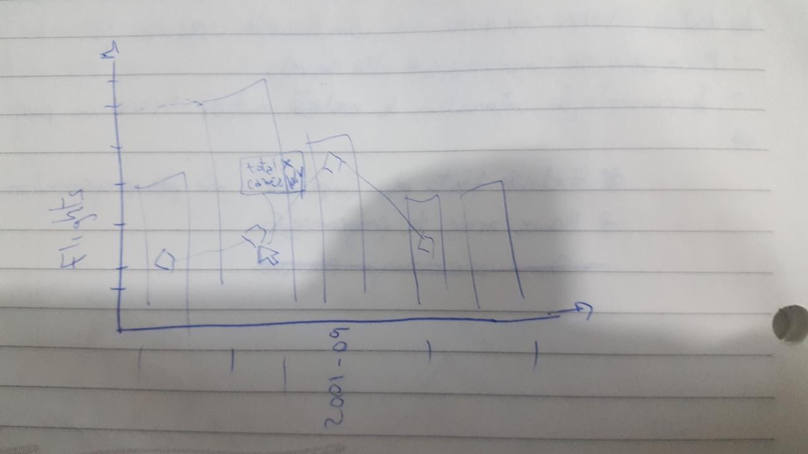

# Flights Visualization
It can be visualized in the following link: [Flights Visualization](https://jader.ml/flights)

## Abstract
    In this visualization I present the impact of flights cancellation caused by the terrorist
    attack of september-11 in 2001. In this attack, terrorists kidnapped and used planes, going
    to New York, to crash it against a famous building, World Trade Center, killing thousands of
    civilians. In september there was a huge increase in cancellations as government measures,
    to mitigate/investigate future attacks, and part by curtomers fears about future attacks.

## Design
    I want to point out the huge cancelling to flights that happened in september caused by
    the terrorist attack, part by government actions, part customers fears. An important
    information is to show the total flights, as some months could be more flights than others,
    like period o vacations, etc. Than I notice an interesting thing, flights also decreased a
    little too, so it reinforced the need of this info in the plot. In the beggining
    I intended to plot total flights and cancellations in the same scale but as the cancelling
    ratio is too low compared to all flights it difficulted to see the real impact of the attack
    to I put it in another axis. I chose to use a more flashy color for cancellations to point out
    the main takeaway, also a different plot style, points, to break the scale context.
    The default color for dimplesjs, the api used, is borring, so I did some research and picked
    interesting colors in colorhunt, adding a more appealling aesthetics to the graph. Then I
    applied the IBM font as it looks more "journalistic", then some minor adjustments to sizes and
    spacements.
    I fixed chronology axis as it was ordering by lexigraphical order.

## Feedback
### feed 1
- what do you notice in the visualization?
    in septemer of 2001 had a growth in cancelation.
- what questions do you have about the data?
    how it was obtained.
- what relationships do you notice?
    the highest peak was at the same time as the terrorist attack.
- what do you think is the main takeaway from this visualization?
    relation the terrorist attack with the flights cancellments.
- is there something you don’t understand in the graphic?
    the axis at the right is a little confuse because it misguided the cancelled flights is
    more than total

### feed 2
- what do you notice in the visualization?
    the number of cancelled flights in ny was too high.
- what questions do you have about the data?
    they are real?
- what relationships do you notice?
    the terrorist attack was in the same month/year as the highest cancellations.
- what do you think is the main takeaway from this visualization?
    show the relation between terrorist attacks and canceled flights.
- is there something you don’t understand in the graphic?
    as it happened a long time ago, did not remember exactly what it was.

### feed 3
- what do you notice in the visualization?
    the data presents chronological information about flights.
- what questions do you have about the data?
    the canceled flight would occur that month or occured that month.
- what relationships do you notice?
    there was a trend in reducing cancellations that stopped with the attack.
- what do you think is the main takeaway from this visualization?
    the change that the attack made to cancellations.
- is there something you don’t understand in the graphic?
    the chronological axis is confuse and took some time to understand.

## Resources

- https://github.com/PMSI-AlignAlytics/dimple/wiki
- https://colorhunt.co/
- https://github.com/d3/d3/wiki
- http://stat-computing.org/dataexpo/2009/the-data.html
